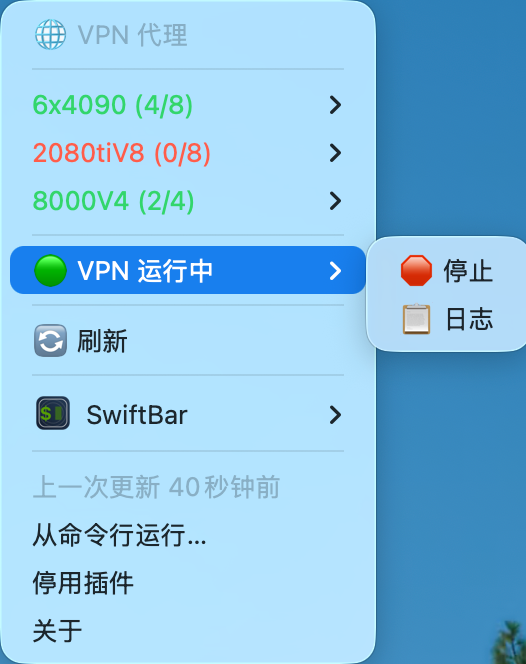

# GPUBar-Pro 🟢🌐

> 基于 [RemoteGPU-Bar](https://github.com/ZeyuuuChen/RemoteGPU-Bar) 的增强版，新增 **多服务器支持** 和 **VPN 自动代理** 功能。


[English](#english) | [中文](#中文说明)

---

## 📸 截图

|         服务器列表         |           GPU 详情            |
| :------------------------: | :---------------------------: |
|  |  |

---

## ✨ 新增功能

相比原版，本项目增加了以下功能：

| 功能                 | 描述                                |
| -------------------- | ----------------------------------- |
| 🖥️ **多服务器支持**  | 同时监控多台 GPU 服务器             |
| 🌐 **VPN 代理集成**  | 通过 Docker 运行 EasyConnect VPN    |
| 🔄 **智能网络切换**  | 自动检测并切换直连/代理模式         |
| 🎛️ **一键 VPN 控制** | 菜单栏直接启动/停止 VPN             |
| 🔗 **SSH 智能代理**  | Cursor/VSCode Remote SSH 自动走代理 |

---

## 🛠 安装

### 前置要求

- macOS
- [SwiftBar](https://github.com/swiftbar/SwiftBar) 或 [xbar](https://xbarapp.com/)
- SSH 免密登录已配置
- [Docker Desktop](https://www.docker.com/products/docker-desktop/)（如需 VPN 功能）

### 安装步骤

1. **下载文件**

```bash
git clone https://github.com/ZOENON/GPUBar-Pro.git
cd GPUBar-Pro
```

2. **复制到 SwiftBar 插件目录**

```bash
cp gpu_monitor.1m.sh ~/Documents/SwiftBar/
cp vpn_control.sh ~/Documents/SwiftBar/
chmod +x ~/Documents/SwiftBar/*.sh
```

3. **配置 SSH 智能代理**（可选，用于 Cursor/VSCode）

```bash
cp proxy.sh ~/.ssh/
chmod +x ~/.ssh/proxy.sh
```

---

## ⚙️ 配置

### 1. 配置服务器列表

编辑 `gpu_monitor.1m.sh`：

```bash
SERVERS=(
  "Server1|user|192.168.1.100|22"
  "Server2|root|192.168.1.101|22"
  # 添加更多服务器...
)
```

格式：`别名|用户名|主机IP|SSH端口`

### 2. 配置 VPN（如需）

编辑 `vpn_control.sh`：

```bash
EC_SERVER="https://vpn.your-school.edu.cn"
EC_USERNAME="your_username"
EC_PASSWORD="your_password"
```

### 3. 配置 SSH 智能代理（可选）

在 `~/.ssh/config` 中添加：

```ssh-config
Host your-server
    HostName 192.168.1.100
    User root
    Port 22
    ProxyCommand ~/.ssh/proxy.sh %h %p
```

这样 Cursor/VSCode 的 Remote SSH 也会自动走 VPN 代理。

---

## 🌐 VPN 工作原理

SwiftBar 菜单栏 → `gpu_monitor.1m.sh` → Docker EasyConnect (SOCKS5:1080) → VPN 隧道 → 校内 GPU 服务器

### 支持的 VPN

本项目使用 [docker-easyconnect](https://github.com/docker-easyconnect/docker-easyconnect) 支持深信服 EasyConnect VPN。

首次使用需拉取镜像：

```bash
docker pull hagb/docker-easyconnect:cli
```

---

## 📖 使用方法

### 日常使用

| 场景     | 操作                               |
| -------- | ---------------------------------- |
| 校内     | 直接使用，自动直连                 |
| 校外     | 点击「🚀 启动」VPN，等待连接后刷新 |
| 不需要时 | 点击「🛑 停止」关闭 VPN            |

### 命令行控制 VPN

```bash
./vpn_control.sh start    # 启动
./vpn_control.sh stop     # 停止
./vpn_control.sh status   # 查看状态
./vpn_control.sh restart  # 重启
```

---

## 💻 Cursor/VSCode Remote SSH 配置

通过 VPN 代理，让 Cursor/VSCode 在本机显示界面，后端 (vscode-server) 运行在远程 GPU 服务器上。

**工作流程**：Cursor (本机前端) → SSH → proxy.sh (智能代理) → Docker EasyConnect → VPN 隧道 → 远程 GPU 服务器 (vscode-server 后端)

### 配置步骤

#### 1. 复制代理脚本

```bash
cp proxy.sh ~/.ssh/
chmod +x ~/.ssh/proxy.sh
```

#### 2. 配置 SSH

编辑 `~/.ssh/config`，为每台服务器添加配置：

```ssh-config
# GPU 服务器 1
Host gpu-server1
    HostName 192.168.1.100
    User root
    Port 22
    ProxyCommand ~/.ssh/proxy.sh %h %p

# GPU 服务器 2
Host gpu-server2
    HostName 192.168.1.101
    User root
    Port 25792
    ProxyCommand ~/.ssh/proxy.sh %h %p

# 可以添加更多服务器...
```

> 💡 **关键点**：`ProxyCommand ~/.ssh/proxy.sh %h %p` 会自动检测 VPN 状态：
>
> - VPN 运行时 → 走 SOCKS5 代理
> - VPN 未运行 → 直连（适用于校内网络）

#### 3. 配置 SSH 免密登录

```bash
# 生成密钥（如果还没有）
ssh-keygen -t ed25519

# 复制公钥到服务器
ssh-copy-id gpu-server1
ssh-copy-id gpu-server2
```

#### 4. 在 Cursor/VSCode 中连接

1. 安装 **Remote - SSH** 扩展
2. 按 `Cmd+Shift+P`，输入 `Remote-SSH: Connect to Host`
3. 选择配置好的服务器（如 `gpu-server1`）
4. 等待 vscode-server 自动安装完成
5. 开始编码！🎉

### 使用流程

| 场景 | 操作                                          |
| ---- | --------------------------------------------- |
| 校内 | 直接打开 Cursor，连接服务器                   |
| 校外 | 先从菜单栏启动 VPN，等连接成功后再打开 Cursor |

### 常见问题

**Q: Cursor 连接时卡住？**

A:

1. 确认 VPN 已连接（菜单栏显示 🟢）
2. 终端测试：`ssh gpu-server1` 是否正常
3. 查看日志：`~/.cursor-server/` 或 `~/.vscode-server/`

**Q: 连接后插件不工作？**

A: Remote SSH 模式下，部分插件需要在远程安装。点击扩展图标，选择「在 SSH: xxx 中安装」。

**Q: 如何使用远程服务器的 GPU？**

A: 连接成功后，在 Cursor 终端中运行的代码自动使用远程 GPU：

```python
import torch
print(torch.cuda.is_available())  # True
print(torch.cuda.device_count())  # 8 (取决于服务器)
```

---

## ❓ FAQ

**Q: VPN 连接失败？**

A: 检查以下几点：

- Docker Desktop 是否运行
- VPN 服务器地址是否正确
- 用户名密码是否正确
- 查看日志：`docker logs easyconnect`

**Q: 如何修改刷新频率？**

A: 修改文件名中的 `.1m.` 部分，如 `.30s.` 为 30 秒刷新。

**Q: Apple Silicon Mac 有警告？**

A: 正常现象，docker-easyconnect 镜像是 x86 的，会通过 Rosetta 运行。

---

## 🙏 致谢

- [RemoteGPU-Bar](https://github.com/ZeyuuuChen/RemoteGPU-Bar) - 原始项目
- [docker-easyconnect](https://github.com/docker-easyconnect/docker-easyconnect) - EasyConnect Docker 镜像
- [SwiftBar](https://github.com/swiftbar/SwiftBar) - macOS 菜单栏工具

---

## 📄 License

MIT License

基于 [ZeyuuuChen/RemoteGPU-Bar](https://github.com/ZeyuuuChen/RemoteGPU-Bar) 修改

---

<a name="english"></a>

# English

## GPUBar-Pro 🟢🌐

An enhanced version of [RemoteGPU-Bar](https://github.com/ZeyuuuChen/RemoteGPU-Bar) with **multi-server support** and **VPN auto-proxy** features.

### Screenshots

|       Server List        |         GPU Details          |
| :----------------------: | :--------------------------: |
|  |  |

### New Features

- 🖥️ **Multi-server support** - Monitor multiple GPU servers simultaneously
- 🌐 **VPN proxy integration** - Run EasyConnect VPN via Docker
- 🔄 **Smart network switching** - Auto-detect and switch between direct/proxy mode
- 🎛️ **One-click VPN control** - Start/stop VPN directly from menu bar
- 🔗 **SSH smart proxy** - Cursor/VSCode Remote SSH auto-routes through proxy

### Quick Start

1. Clone this repo
2. Copy scripts to SwiftBar plugin folder
3. Edit `gpu_monitor.1m.sh` to add your servers
4. Edit `vpn_control.sh` with your VPN credentials (if needed)
5. Enjoy! 🎉

See Chinese section above for detailed instructions.
